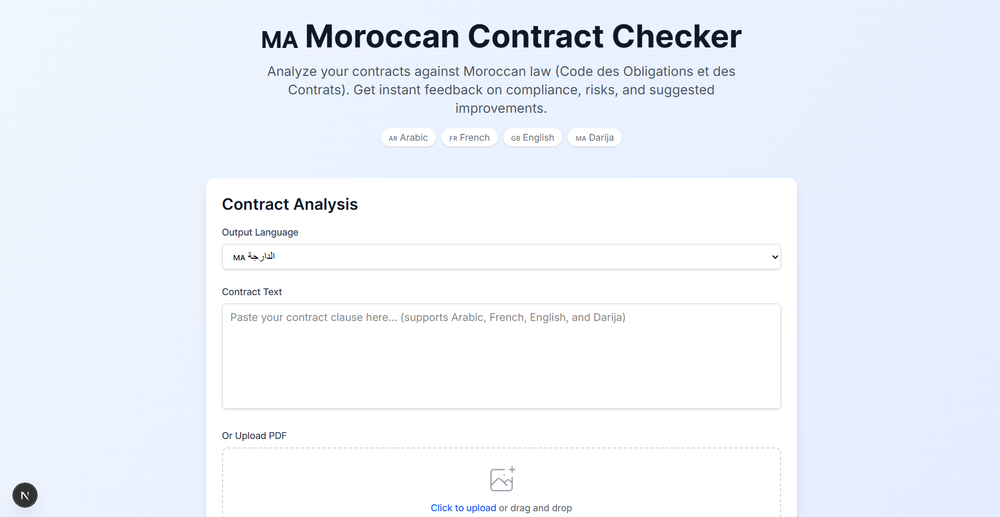
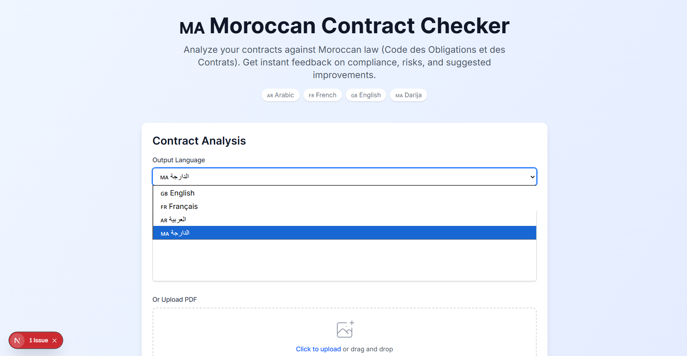
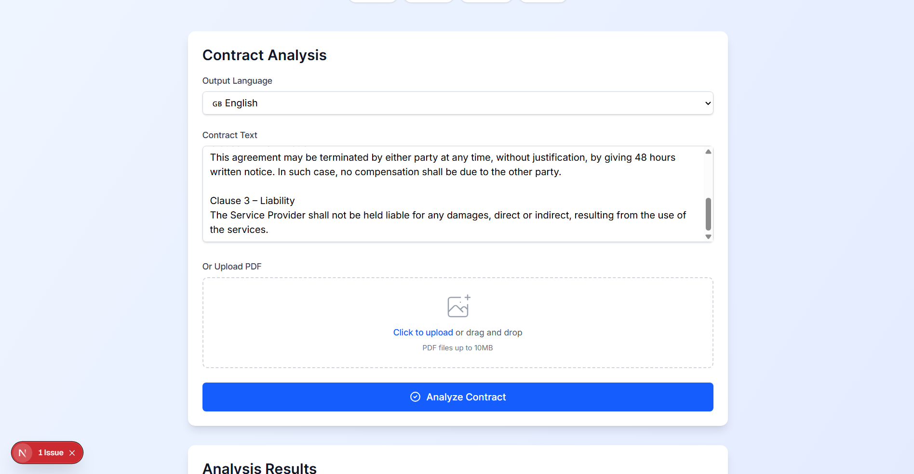
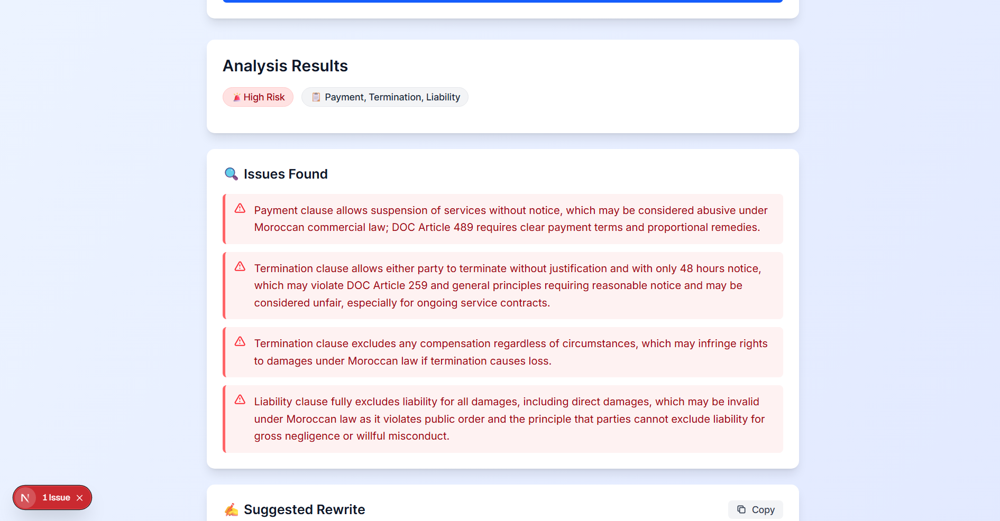
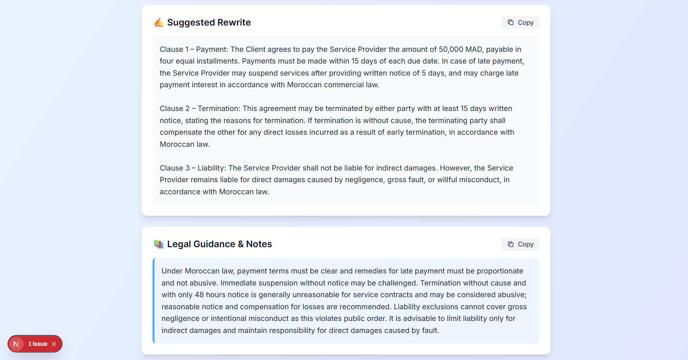
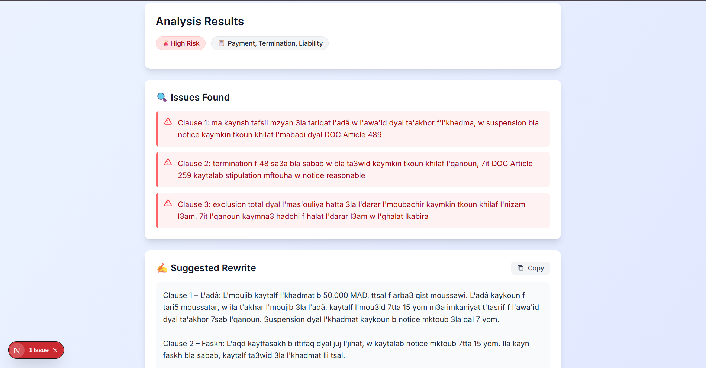

# Moroccan Contract Checker

🏆 Built for the **Cursor Hackathon on september  14th 2025 in Casablanca, Morocco**

A comprehensive Next.js 14 application that analyzes contract clauses against Moroccan law using AI with a built-in legal knowledge base. Built for the **Cursor Hackathon on september  14th 2025 in Casablanca, Morocco**.


<div align="center">

</div>


## Features

- **Multi-language Support**: Analyze contracts in Arabic, French, English, or Darija
- **PDF Processing**: Upload and extract text from PDF contracts (up to 10MB)
- **Legal Knowledge Base**: Uses keyword-based retrieval from Moroccan legal documents (Code des Obligations et des Contrats)
- **AI Analysis**: Powered by Azure OpenAI for intelligent contract analysis
- **Responsive Design**: Beautiful, mobile-friendly interface with Tailwind CSS
- **Real-time Results**: Instant analysis with severity levels, categories, and suggestions

## Tech Stack

- **Framework**: Next.js 14 with App Router
- **Language**: TypeScript
- **Styling**: Tailwind CSS
- **AI**: Azure OpenAI API
- **PDF Processing**: pdf-parse
- **Deployment**: Ready for Vercel, Netlify, or any Node.js hosting

## Prerequisites

- Node.js 18+ 
- Azure OpenAI API key and deployment

## Installation

1. **Clone the repository**
   ```bash
   git clone <repository-url>
   cd moroccan-contract-checker
   ```

2. **Install dependencies**
   ```bash
   npm install
   ```

3. **Set up environment variables**
   ```bash
   cp .env.example .env.local
   ```
   
   Add your Azure OpenAI configuration to `.env.local`:
   ```
   AZURE_OPENAI_API_KEY=your_azure_openai_api_key
   AZURE_OPENAI_ENDPOINT=your_azure_openai_endpoint
   AZURE_DEPLOYMENT_NAME_GPT5=your_gpt_deployment_name
   ```

4. **Run the development server**
   ```bash
   npm run dev
   ```

5. **Open your browser**
   Navigate to [http://localhost:3000](http://localhost:3000)

## Usage

1. **Choose Output Language**: Select Arabic, French, English, or Darija
2. **Input Contract Text**: Either paste text directly or upload a PDF file
3. **Analyze**: Click "Analyze Contract" to get AI-powered insights
4. **Review Results**: Get severity assessment, category classification, suggested rewrites, and legal notes
5. **Copy Results**: Use built-in copy buttons for easy sharing

## 📸 Screenshots

<div align="center">

### Main Interface


### PDF Upload Feature


### Analysis Results and Issue Detection


### Legal Guidance and Rewrite Suggestions


### Multi-language Support (Darija)


</div>

## Legal Knowledge Base

The application includes a comprehensive legal knowledge base with keyword-based retrieval covering:

- **Payment Obligations**: Article 489 of DOC and related provisions
- **Contract Termination**: Article 259 and resolution conditions
- **Liability & Damages**: Article 77 and civil responsibility
- **Confidentiality**: Trade secrets and information protection
- **Force Majeure**: Article 269 and obligation extinction
- **Contract Formation**: Article 2 and validity requirements
- **Commercial Practices**: Payment terms and commercial law

## API Endpoints

### POST `/api/check`
Analyzes contract clauses
```json
{
  "clause": "contract text to analyze",
  "outputLanguage": "en|fr|ar|darija"
}
```

### POST `/api/extract-pdf`
Extracts text from PDF files
- Accepts multipart/form-data with PDF file
- Returns extracted text and metadata

## Responsive Design

- **Desktop**: Full-featured interface with side-by-side layouts
- **Tablet**: Optimized for medium screens
- **Mobile**: Touch-friendly interface with stacked layouts

## Deployment

### Vercel (Recommended)
```bash
npm run build
vercel --prod
```

### Other Platforms
```bash
npm run build
npm start
```

## Environment Variables

| Variable | Description | Required |
|----------|-------------|----------|
| `AZURE_OPENAI_API_KEY` | Azure OpenAI API key for AI analysis | ✅ |
| `AZURE_OPENAI_ENDPOINT` | Azure OpenAI endpoint URL | ✅ |
| `AZURE_DEPLOYMENT_NAME_GPT5` | Azure OpenAI GPT deployment name | ✅

## Analysis Output

The application provides structured analysis including:

- **Severity**: Low, Medium, High risk assessment
- **Category**: Payment, Termination, Liability, etc.
- **Language Detection**: Automatic input language detection
- **Suggested Rewrite**: Improved clause in selected output language
- **Legal Notes**: Practical guidance and recommendations
- **Raw JSON**: Complete analysis data for integration


## Legal Disclaimer

This application is for informational purposes only and does not constitute legal advice. Always consult with qualified legal professionals for official legal guidance regarding Moroccan law and contract compliance.


## 🏆 Hackathon

Built for the **Cursor Hackathon on september  14th 2025 in Casablanca, Morocco** - showcasing the power of AI-assisted development and legal technology innovation.

